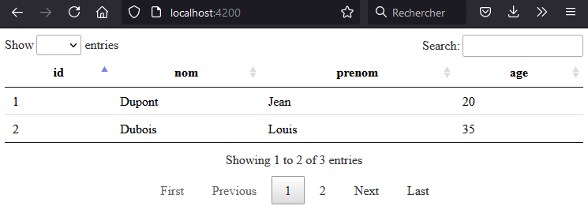

# Initialisation du back (API Spring boot)

Téléchargement du back sur le site https://start.spring.io/

J'ai choisi la version de spring boot 2.5.2 avec un packaging en Jar pour la version 11 de Java.

De plus j'ai chosi comme dépendance :
- Spring Web
- Spring Data JPA
- PostgreSQL Driver

Donc cela à rajouter ces dépendances au pom.xml:
```xml
<dependency>
	<groupId>org.springframework.boot</groupId>
	<artifactId>spring-boot-starter-data-jpa</artifactId>
</dependency>
<dependency>
	<groupId>org.springframework.boot</groupId>
	<artifactId>spring-boot-starter-web</artifactId>
</dependency>

<dependency>
	<groupId>org.postgresql</groupId>
	<artifactId>postgresql</artifactId>
	<scope>runtime</scope>
</dependency>
```

Dans le code nous avons également configurer les CORS sur la totalité de l'application car sinon le front ne pourra pas communiquer avec le back car 2 urls différentes, pour cela il faut configurer le CORS pour accepter les requêtes venant de http://localhost:4200 qui est l'url du front en développement :
```java
package com.example.demo.config;

import org.springframework.context.annotation.Bean;
import org.springframework.stereotype.Component;
import org.springframework.web.servlet.config.annotation.CorsRegistry;
import org.springframework.web.servlet.config.annotation.WebMvcConfigurer;

@Component
public class WebMvcConfigurerConfig {

    @Bean
    public WebMvcConfigurer corsConfigurer() {
        return new WebMvcConfigurer() {
            @Override
            public void addCorsMappings(CorsRegistry registry) {
                registry
                        .addMapping("/**")
                        .allowedMethods("GET", "POST", "PUT", "DELETE")
                        .allowedOrigins("http://localhost:4200");
            }
        };
    }
}
```

Dans la base de données créer la table personne avec des personnes :
```sql
create table personne
(
	id serial
		constraint personne_pk
			primary key,
	nom varchar not null,
	prenom varchar not null,
	age int not null
);

insert into personne (nom, prenom, age) values ('Dupont', 'Jean', 20);
insert into personne (nom, prenom, age) values ('Dubois', 'Louis', 35);
insert into personne (nom, prenom, age) values ('Durand', 'Pierre', 45);
```

Dans le fichier application.properties modifier ces lignes :
- spring.datasource.url=jdbc:postgresql://localhost:5432/postgres --> modifier l'url pour arriver sur votre bdd
- spring.datasource.username=postgres --> modifier pour mettre le user de votre bdd
- spring.datasource.password=password --> modifier pour mettre le password de votre base

Ensuite démarrer le projet, la seule URL qui fonctionne est http://localhost:8080 qui retourne la liste des personnes.

Cette URL retourne :
```json
[
  {
    "id":1,
    "nom":"Dupont",
    "prenom":"Jean",
    "age":20
  },
  {
    "id":2,
    "nom":"Dubois",
    "prenom":"Louis",
    "age":35
  },
  {
    "id":3,
    "nom":"Durand",
    "prenom":"Pierre",
    "age":45
  }
]
```

# Initialisation du front (Angular 12)
Pour l'Initialisation j'ai entré cette commande dans un terminal : `ng new demo-front` ensuite j'ai dit "oui" pour le routing et j'ai choisi CSS pour le style.

**Ajouter le HttpClientModule pour les requêtes à l'API**
Importer HttpClientModule dans le fichier **app.module.ts** :

```ts
import {NgModule} from '@angular/core';
import {BrowserModule} from '@angular/platform-browser';

import {AppRoutingModule} from './app-routing.module';
import {HttpClientModule} from '@angular/common/http';
import {AppComponent} from './app.component';

@NgModule({
  declarations: [
    AppComponent
  ],
  imports: [
    BrowserModule,
    AppRoutingModule,
    HttpClientModule
  ],
  providers: [],
  bootstrap: [AppComponent]
})
export class AppModule {
}
```

Grâce à l'importation de ce module nous pourrons faires des appels à notre API.

**Ajouter les datatables**

il y a une installation automatique : `ng add angular-datatables`  

Ou une installation manuel :

A la racine du projet front entrer cette commande pour ajouter des datatables :
```sh
npm install jquery --save
npm install datatables.net --save
npm install datatables.net-dt --save
npm install angular-datatables --save
npm install @types/jquery --save-dev
npm install @types/datatables.net --save-dev
```

Modifier le fichier angular.json pour qu'il intègre ces lignes en supplément de celle déjà présente :
```json
"projects": {
    "front-demo": {
      "architect": {
        "build": {
          "options": {
            "styles": [
              "node_modules/datatables.net-dt/css/jquery.dataTables.css"
            ],
            "scripts": [
              "node_modules/jquery/dist/jquery.js",
              "node_modules/datatables.net/js/jquery.dataTables.js"
            ],
						...
          }
}
```

Importer DataTablesModule dans le fichier **app.module.ts** :
```ts
import {NgModule} from '@angular/core';
import {BrowserModule} from '@angular/platform-browser';

import {AppRoutingModule} from './app-routing.module';
import {HttpClientModule} from '@angular/common/http';
import {DataTablesModule} from "angular-datatables";
import {AppComponent} from './app.component';

@NgModule({
  declarations: [
    AppComponent
  ],
  imports: [
    BrowserModule,
    AppRoutingModule,
    HttpClientModule,
    DataTablesModule
  ],
  providers: [],
  bootstrap: [AppComponent]
})
export class AppModule {
}
```

Voila dataTables est installé sur notre application angular.

## Création du component contenant la page d'accueil

Dans le dossier **src/app** créer un dossier **page** dans celui-ci entrer la commande `ng generate component accueil`

Qui dit application angular dit souvent plusieurs pages donc le routing est utilise mettons le en place :  
Dans le fichier fichier **app.component.html** effacer tout et insérer cela :
```html
<router-outlet></router-outlet>
```

Puis modifier le fichier **app-routing.module.ts** et dans le tableau de route ajouter la route principal notre page d'accueil :
```ts
const routes: Routes = [
  {
    path :'',
    component: AccueilComponent
  }
];
```

Ensuite démarrer le serveur avec la commande `ng serve` puis accèder à l'URL http://localhost:4200 et il sera écrit "accueil works!" message contenu dans le html du component accueil

## Communication front -> back
Modifier le fichier **environnement.ts** (fichier d'environnement utiliser uniquement en dev si il y en aussi besoin en production il faudra également modifier le fichier environnement.prod.ts qui écrasera le fichier environnement.ts lors d'un build). Cela permettra si besoin de modifier l'url du back de le faire une unique fois pour l'ensemble de l'application.    
Dans celui-ci ajouter l'URL de notre back :
```ts
export const environment = {
  production: false,
  urlBack: 'http://localhost:8080'
};
```

Comme nous connaissons l'architecture de la réponse de l'API nous allons créer un model correspondant au retour de l'API.  
Dans le dossier **src/app** créer un dossier **models** et dans celui créer un model dont le fichier s'appelle **personne.ts**:
```ts
export class Personne {
  id: number;
  nom: string;
  prenom: string;
  age: number;


  constructor(id: number, nom: string, prenom: string, age: number) {
    this.id = id;
    this.nom = nom;
    this.prenom = prenom;
    this.age = age;
  }
}
```

Dans le dossier **src/app** créer un dossier **services** et dans celui créer un service personne : `ng generate service personne`  
Celui-ci permettra d'effectuer les requêtes vers le back pour les personnes.  
Nous allons grâce la class HttpClient importé avec HttpClientModule précédemment appelé l'url de notre back :
```ts
import {Injectable} from '@angular/core';
import {environment} from "../../environments/environment";
import {HttpClient} from "@angular/common/http";
import {Observable} from "rxjs";
import {Personne} from "../models/personne";

@Injectable({
  providedIn: 'root'
})
export class PersonneService {

  private URL = environment.urlBack;

  constructor(private http: HttpClient) {
  }

  getAllPersonnes(): Observable<Personne[]> {
    return this.http.get<Personne[]>(this.URL);
  }
}
```
Nous pouvons voir qu'on utilise environnement c'est où est stocké notre URL de l'API. Sur cette URL nous faison un GET qui renverra un tableau de l'objet Personne créer dans notre front conformément au retour du back.

Dans un premier temps nous allons afficher le retour de cette réponse dans la console du navigateur.  
Pour cela nous appellons notre service dans notre component accueil et nous faison un console.log(...):
```ts
import { Component, OnInit } from '@angular/core';
import {PersonneService} from "../../services/personne.service";

@Component({
  selector: 'app-accueil',
  templateUrl: './accueil.component.html',
  styleUrls: ['./accueil.component.css']
})
export class AccueilComponent implements OnInit {

  constructor(private personneService: PersonneService) { }

  ngOnInit(): void {
    this.personneService.getAllPersonnes().subscribe(
      (data) => {
        console.log(data);
      },
      (error) => console.error(error)
    );
  }
}
```

## Affichage de nos personnes avec dataTable
Tout cette partie se passe dans le component **accueil**.

Voici le code TS de notre component :
```ts
import { Component, OnInit } from '@angular/core';
import {PersonneService} from "../../services/personne.service";
import {Personne} from "../../models/personne";
import {Subject} from "rxjs";

@Component({
  selector: 'app-accueil',
  templateUrl: './accueil.component.html',
  styleUrls: ['./accueil.component.css']
})
export class AccueilComponent implements OnInit {

  //Contient la liste des personnes récupérer de l'API pour l'utiliser dans le HTML
  listPersonne: Personne[] = [];

  // Option de notre dataTables
  dtOptions: DataTables.Settings = {};

  // Trigger de notre dataTables
  dtTrigger: Subject<any> = new Subject<any>();

  constructor(private personneService: PersonneService) { }

  ngOnInit(): void {
    // Init des options de notre dataTables
    this.dtOptions = {
      pagingType: 'full_numbers', // type de pagination
      pageLength: 2 // nom d'élément par page ici 2
    };
    // Appel de notre service qui va appeler le bac
    this.personneService.getAllPersonnes().subscribe(
      (data) => {
        console.log(data);
        // Nous mettons les données dans une variable afin de les utiliser dans le HTML
        this.listPersonne= data;
        // Permet de rafraichir la dataTable
        this.dtTrigger.next();
      },
      (error) => console.error(error)
    );
  }
}
```

Voici le code HTML de notre component :
```html
<table datatable [dtOptions]="dtOptions" [dtTrigger]="dtTrigger" class="row-border">
  <thead>
  <tr>
    <th>id</th>
    <th>nom</th>
    <th>prenom</th>
    <th>age</th>
  </tr>
  </thead>
  <tbody>
  <tr *ngFor="let personne of listPersonne">
    <td>{{personne.id}}</td>
    <td>{{personne.nom}}</td>
    <td>{{personne.prenom}}</td>
    <td>{{personne.age}}</td>
  </tr>
  </tbody>
</table>
```
Nous retrouvons les options et le trigger de notre dataTable définie dans le code TS du component. Puis une boucle sur le tableau de personne afin de les afficher.


Voici le résultat final :


# Conclusion

Voici un lien pour comprendre les dataTables avec Angular : https://l-lin.github.io/angular-datatables/#/welcome

Dans l'API je retourne directement l'entité par le controlleur celle-ci est une mauvaise pratique car peut être qu'il y aurait des données confidentiels qui ne doivent pas sortir (exemple: mot de passe) pour éviter cela utiliser un DTO sur l'entité personne afin de retourner que les données voulues.


# Dockerfile

## postgresql
```sh
docker pull postgres
docker run --name postgres -e POSTGRES_PASSWORD=password -e POSTGRES_DB=db -p 5432:5432 -d postgres
```

## back
Commande a éxécuter dans le dossier **demo-back**
```
docker build -t back .
docker run --name back -p 8080:8080 -d back
```

Pour que cela fonctione j'ai modifié le fichier de properties pour avoir les variables d'environnement, vive les variables d'environnement !!!!

## front
Commande a éxécuter dans le dossier **demo-front**
```
docker build -t front .
docker run --name front -p 80:80 -d front
```

## Conclusion
Inconvéniant, la communication entre container.  
Entre le font et le back pas de problème car le navigateur qui fait les requêtes.  
Mais entre le back et la BDD il faut connaitre l'IP est non localhost car sinon sa ne marche pas et celle-ci change donc c'est pas top sinon il faudrait créer un network pour les connecter.  
Pour une application entière comme ici le mieux serait d'utiliser Docker compose.

# Docker compose
Commande a éxécuter à la racine du projet
```sh
# start
docker-compose -f app.yml up -d
# stop et suppression des volumes
docker-compose -f app.yml down -v
```

## Conclusion
Avantages, tout se passe avec une seule commande, un réseau est créé entre les containers (ici la bdd est inacessible de l'extérieur et pourtant le back y a accès) et l'ensemble des variables environnement etc est centralisé. 

On pourrait améliorer cela en partageant un répertoire pour stocker la bdd afin qu'elle ne soit pas supprimé à chaque fois (ou ne pas supprimer les volumes mais par nettoyage on pourrait vite les supprimer).